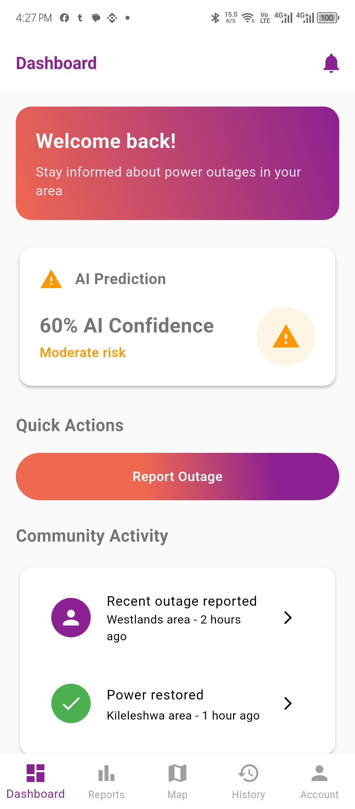
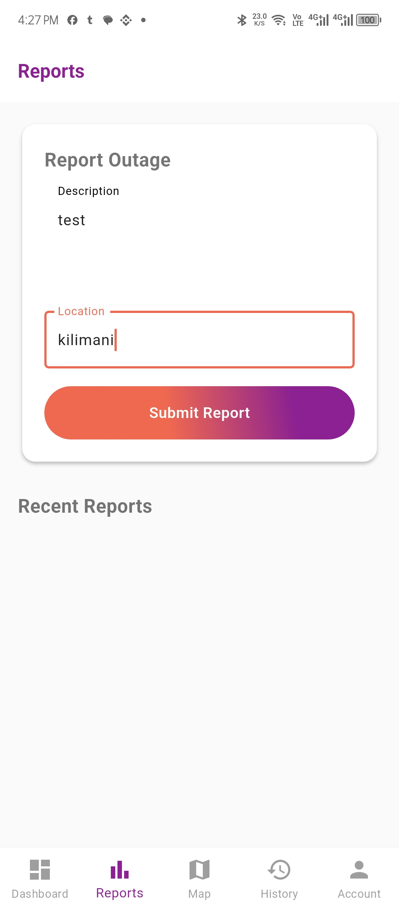
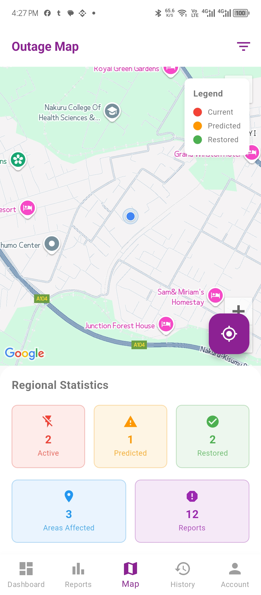
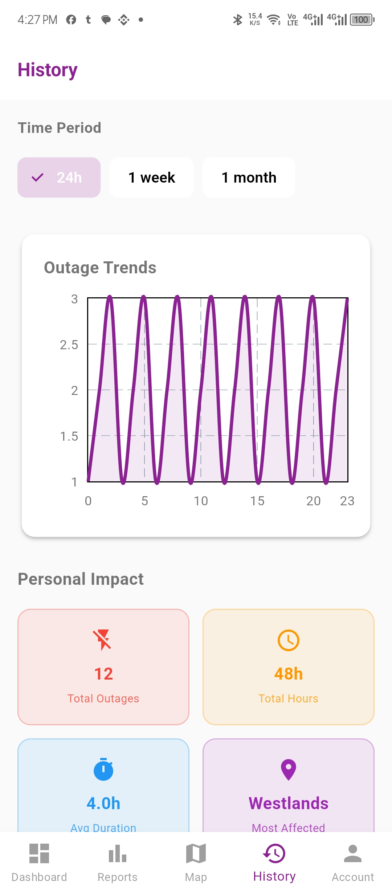
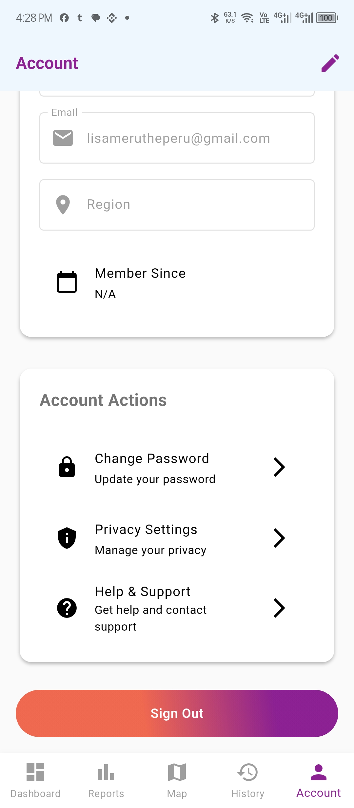
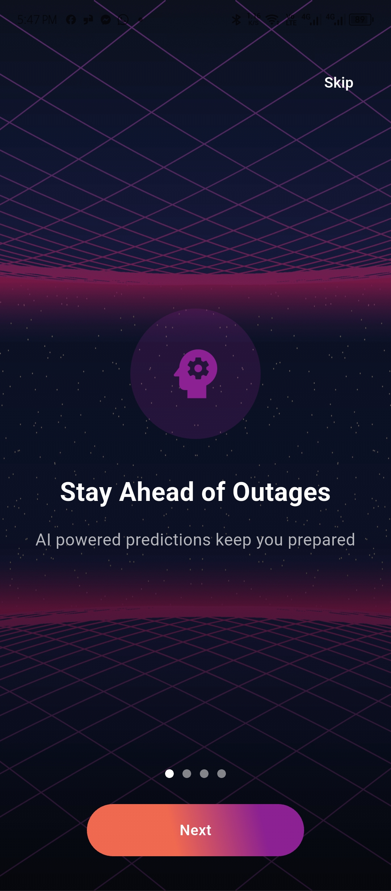
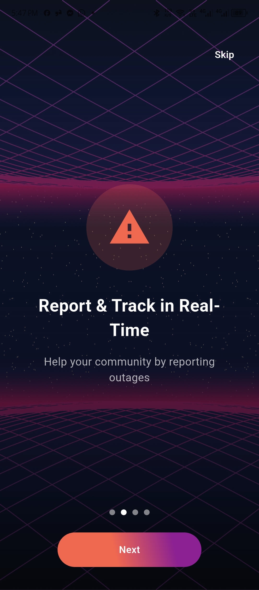
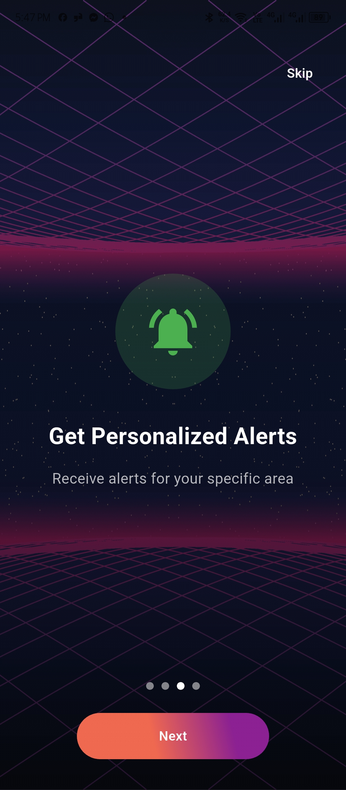
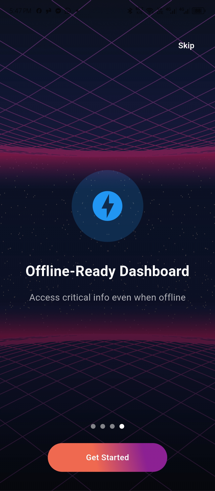

# Stima Sense - AI-Powered Outage Prediction App

A Flutter-based mobile application that uses AI and machine learning to predict power outages in real-time, providing users with personalized alerts and community-driven reporting.

## Features

### Core Functionality
- **AI-Powered Predictions**: Machine learning models predict power outages based on historical data and weather conditions
- **Real-Time Reporting**: Community-driven outage reporting with location tracking
- **Personalized Alerts**: Location-based notifications for outage predictions and updates
- **Interactive Dashboard**: Comprehensive overview of power status and community activity
- **Offline Capabilities**: Access critical information even without internet connection

### User Experience
- **Multi-language Support**: English and Swahili localization
- **Dark/Light Theme**: Customizable appearance with theme persistence
- **Profile Management**: User profiles with photo upload and region settings
- **Community Engagement**: Like and comment system for outage reports
- **Interactive Map**: Real-time outage visualization with filtering options

### Technical Features
- **Firebase Integration**: Authentication, Firestore database, and ML model hosting
- **Google Maps**: Location services and outage mapping
- **Weather API**: Real-time weather data for improved predictions
- **Push Notifications**: Local and remote notification system
- **Image Handling**: Profile picture upload with persistent storage

## Tech Stack

### Frontend
- **Flutter**: Cross-platform mobile development framework
- **Dart**: Programming language
- **Material Design**: UI/UX components

### Backend & Services
- **Firebase Authentication**: User management and security
- **Cloud Firestore**: NoSQL database for real-time data
- **Firebase ML Model Downloader**: Machine learning model hosting
- **Google Maps API**: Location services and mapping
- **WeatherAPI.com**: Weather data integration

### Machine Learning
- **TensorFlow Lite**: On-device ML inference
- **Firebase ML**: Cloud-based model hosting
- **Automated Retraining**: Continuous model improvement system

## Screenshots

### App Screenshots

<div style="display: flex; flex-wrap: wrap; gap: 10px;">
  
  
  
  
  
  
  
  
  
</div>

*Screenshots showing various features of the Stima Sense app including the dashboard, reports, map view, and user interface.*

## Getting Started

### Prerequisites
- Flutter SDK (3.0 or higher)
- Dart SDK
- Android Studio / VS Code
- Firebase project
- Google Maps API key
- WeatherAPI.com API key

### Installation

1. **Clone the repository**
   ```bash
   git clone https://github.com/yourusername/stima-sense.git
   cd stima-sense
   ```

2. **Install dependencies**
   ```bash
   flutter pub get
   ```

3. **Configure Firebase**
   - Create a Firebase project
   - Download `google-services.json` and place it in `android/app/`
   - Download `GoogleService-Info.plist` and place it in `ios/Runner/`
   - Enable Authentication, Firestore, and ML Model Downloader

4. **Configure API Keys**
   - Add Google Maps API key to `android/app/src/main/AndroidManifest.xml`
   - Add WeatherAPI.com key to `lib/src/services/weather_service.dart`

5. **Run the app**
   ```bash
   flutter run
   ```

## Configuration

### Firebase Setup
1. Create a new Firebase project
2. Enable Authentication (Email/Password, Google Sign-In)
3. Create Firestore database with security rules
4. Upload ML model to Firebase ML Model Downloader
5. Configure Firebase Cloud Functions for automated retraining


### ML Model Configuration
- **Model Name**: `outage_model`
- **Input Format**: `[1, 3]` - Event Month, Event Hour, Outage Duration
- **Output Format**: `[1, 4]` - 4 prediction classes

## Project Structure

```
lib/
├── main.dart                          # App entry point
├── onboarding_screen.dart             # Onboarding flow
├── src/
│   ├── components/
│   │   ├── auth/                     # Authentication screens
│   │   ├── shared/                   # Shared UI components
│   │   └── ...
│   ├── features/
│   │   ├── dashboard/                # Dashboard screen
│   │   ├── reports/                  # Reports and community
│   │   ├── map/                      # Interactive map
│   │   ├── history/                  # Outage history
│   │   ├── settings/                 # App settings
│   │   └── account/                  # User profile
│   ├── services/
│   │   ├── firebase_service.dart     # Firebase operations
│   │   ├── ml/                       # Machine learning
│   │   ├── weather_service.dart      # Weather API
│   │   └── notification_service.dart # Notifications
│   ├── themes/
│   │   └── app_theme.dart           # App theming
│   ├── navigation/
│   │   └── app_router.dart          # Route management
│   └── localization/
│       └── app_localizations.dart   # Multi-language support
```

## Contributing

1. Fork the repository
2. Create a feature branch (`git checkout -b feature/amazing-feature`)
3. Commit your changes (`git commit -m 'Add amazing feature'`)
4. Push to the branch (`git push origin feature/amazing-feature`)
5. Open a Pull Request

## Acknowledgments

- Flutter team for the amazing framework
- Firebase for backend services
- Google Maps for location services
- WeatherAPI.com for weather data
- Community contributors and testers

## Support

For support, email support@stimasense.com or create an issue in this repository.

## Version History

- **v1.0.0** - Initial release with core features
  - AI-powered outage predictions
  - Community reporting system
  - Real-time notifications
  - Multi-language support
  - Dark/light theme
  - Profile management

---

**Note**: This is a work in progress. Some features may be under development or require additional configuration.
